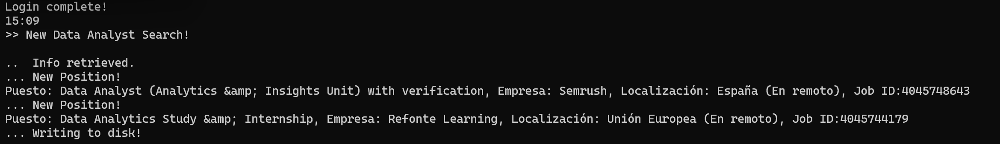

# AUTOMATED LINKEDIN JOB ALERTS

Automate linkedin job alerts based on keywords and location. Run in the background and receive alerts every time a new job is posted matching your criteria.

Just several hours after a new position is posted on likendin, there are always over hundreds of applicants for the position. To be one of the first ones, you should keep repeating searches every few minutes. With this script you can work in other projects and receive an alert every time a new positions comes out. The search will be reapeted after several minutes again (15min by default).

## DISCLAIMER

This a learning project to practice scraping with Selenium and BeautifulSoup. Linkedin offers an [API](https://developer.linkedin.com/) for automation, which could be suited for your purpose.

## LOP (List of open points)

- Select flexibility options (Remote, Hybrid, Office)
- Receive an email when a new job is posted - Optional
- Do more complex searches (combinations of flexibiity and location)

## Installation

Prerequisites: git and Python.

1. Clone the repository
2. Install its dependencies via pip install -r requirements.txt

## Run

In your terminal:
1. Configure ``*.env`` file with your linkedin mail and password. Adjust the Chrome path if needed. 
2. Go to repository folder 
3. ``python run.py``. Note that there are options which you can specify, see below.
4. Check the outputs if you exported the data.

## Options

You can specify different options as arguments:

- ``--keywords`` Key words of job position
- ``--location`` Select the location ID (geoid). Spain by default. To select another location id, check this [post](https://nubela.co/blog/how-to-fetch-geo_id-parameter-for-the-job-api/).
- ``--export`` Keep track of positions in excel file
- ``--export_file`` Select the path for the excel file (job_list.xlsx by default)
- ``--wait_time`` Select repeating frecuency of searches (in minutes, 15 by default)

## Example

``python run.py -k "King" "President of the USA" -l 105646813 -w 20 -e``

## Participate

This is an open source project and you are invited to participate. If you find a bug do not hesitate to submit and issue or even fix it yourself and make a pull request.

